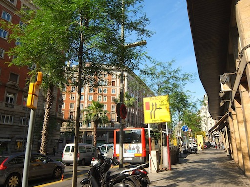

<style type="text/css">
  .reveal h1,
  .reveal h2,
  .reveal h3,
  .reveal h4,
  .reveal h5,
  .reveal h6 {
    text-transform: none;
  }
</style>
# <span style="color:pink">XR Workshop</span>が<br>とっても<br><span style="color:pink">面白かった</span>話

[https://nagahisa.github.io/20220312-xrworkshop/#/](https://nagahisa.github.io/20220312-xrworkshop/#/)

---

## About me

```json: aboutme
aboutme.json
{ 
    "name":　           "Kenzo Nagahisa",
    "twitter":          "@kenzonag",
    "screen_name" :     "けんぞう",
    "interest": [
        {
            "topic":    "XR",
            "level":    "全くの初心者"
        },
        {
            "topic":   "Elixir/Nerves",
            "level":    "永遠の初心者"
        }
    ] 
}
```

最近全然サボってますが・・・BLOGも　<br>
[qiita.com/nagahisa](https://qiita.com/nagahisa),
[medium.com/@kenzonag](https://medium.com/@kenzonag)

---

## そもそも<span style="color:pink">XR Workshop</span>とは

こんな素敵なイベントです！<br>

[Day 1: XRワークショップ(Unityで簡単AR体験)](https://xr-fukuoka.connpass.com/event/240040/) <br>
[Day 2: XRワークショップ(MediaPipe+OpenCV)](https://xr-fukuoka.connpass.com/event/240042/)
<br>
[Day 3: XRワークショップ(自分で作った物を発表)](https://xr-fukuoka.connpass.com/event/240117/)
<br>

### で、本コンテンツはDay.3用です。

---

## <span style="color:pink">Day.1</span>の振り返り

こんなん作りました！<br>
[Day.1成果リンク](https://webxr.run/wx2g34VNEvNG9)

<br>
許可を与えるとカメラが起動するので<br>
以下の画像を写してみてください。<br>


---

## <span style="color:pink">Day.2</span>の振り返り

こんなん作りました！<br>
[Day.2成果リンク](https://kenzo-lightsaber.glitch.me/)

<br>
許可を与えるとカメラが起動するので<br>
手を写して「サムアップ」してみてください。

---

## <span style="color:pink">Day.3</span>

<br>

### 第三回 作品発表会<br>　3/12 (土) 11:00 ~ 16:00
<br>

### ワークショップで作ったものを応用したり，自分で作ったものを発表 

---

# 復習してたら
<br>

# 終わってしまった


---


---

# おしまい　
